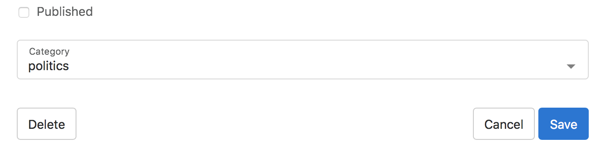
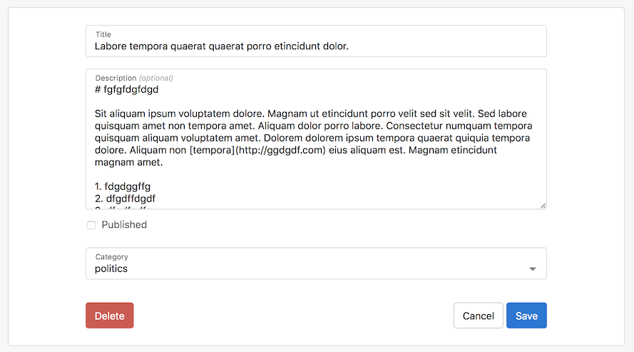
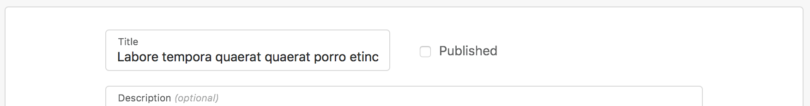
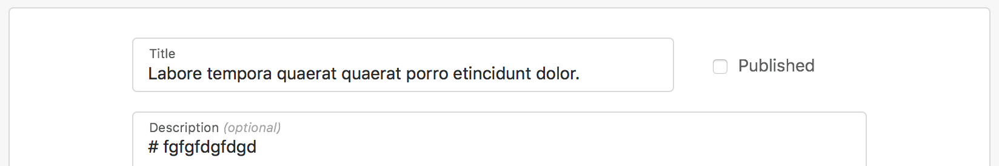
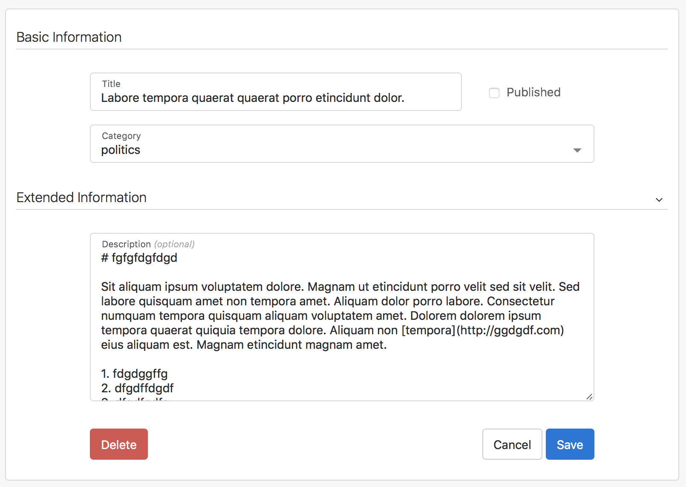

# Working with Forms

Arctic Forms, like the ListViews, add features not present in the standard 
django generics, there are three different views available: `CreateView`, 
`UpdateView` and `FormView`, they all share similar features.

It is recomended to use the project created in the [Lists](lists.md) chapter as
a base to try the examples on this one.

## Actions

By default the Forms include a `Submit` button, but more can be added by using 
the `actions` property, for example:

    actions = [
        ('Delete', ('articles:delete', 'pk'), 'left'),
        ('Cancel', 'cancel'),
        ('Save', 'submit'),
    ]

A default submit button is added if no button of the type 'submit' is provided,
in the case above `Save` will replace the default submit button.
The format of actions is a list of tuples:

    [('Label', 'named_url|cancel|submit', [extra parameters]), ...]

The optional third parameter can be either a string with 'left' to position the
button on the left side of the form, or a dictionary with the keys:
    
    'style': 'primary|secondary|danger' # secondary is default
    'id': 'some-id' # an auto generated id is provided by default
    'position': 'left' # if the button should be on the left side of the form
    'form_action': 'named_url' # for multiple submit buttons a different url can
                               # be provided when the form is successfully 
                               # submitted.

To style the `Delete` button as danger and keep its left position:

    ('Delete', ('articles:delete', 'pk'), {'position': 'left', 'style': 'danger'})

## Layouts

By default forms display one field per row, but this can be customized without
creating a new template by adding a layout property to either `FormView`, 
`UpdateView` or `CreateView`.

To set the published field next to the title field, go to `articles.views.py` 
and add the following layout property:

    layout = [
        ('title', 'is_published'),
        'description',
        'category',
    ]

Adding a tuple around 2 or more fields will put them in the same row, by default
the total length of the row will be evenly distributed, but it is also possible
to specify the length of a field based on a 12 column grid. For example to 
increase the title length to 9 columns append the `|` character to the field 
name followed by 9:

    layout = [
        ('title|9', 'published'),
        'description',
    ]

Finally, forms can be divided in fieldsets, by using a dictionary where the
keys are the titles of each fieldset:

    layout = {
        'Basic Information': [
            ('title|9', 'published'),
            'category',
        ],
        'Extended Information': [
            'description',
        ]
    }

To make a fieldset collapsible, just use the `collapsible` function:

    from arctic.generics import collapsible as c

    layout = {
        'Basic Information': [
            ('title|9', 'published'),
            'category',
        ],
        c('Extended Information'): [
            'description',
        ]
    }

_Note: when using a Python version lower that 3.6, an OrderedDict needs to
be used, since ordering is not maintained in earlier versions._

## Inlines

## Widgets