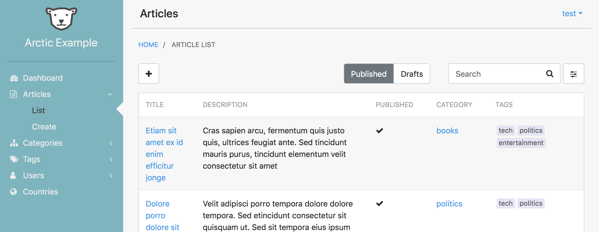

# Overview

Django Arctic is a framework that simplifies the creation of custom content management systems.
It provides a responsive user interface, extends several of the Django 
Generic Views and adds role based authentication.

##Why

There are a lot of content management systems in the market that are a good fit 
for the creation of many web sites.

There is however a tipping point, where customizing a CMS product
is so extensive that it ends up being better to use some lower level framework.

This is the case that Arctic wants to solve, creation of a CMS with a high 
degree of customization.
Instead of being a ready-to-use CMS, Arctic is a framework that facilitates the construction of content management systems.

## Compatibility

* Python 2.7, 3.5, 3.6
* Django 1.8, 1.10, 1.11

## Features

* Configurable menu
* Responsive UI
* Role based authentication with object based permissions.
* Optional tabbed interface to visually link multiple Views.
* ListViews with support for nested fields, sorting, filtering and linking.
* API backed ListViews
* FormViews with custom layouts.
* Form widgets for datetime, multiselect and autocomplete.

## Installation

Arctic is available on PyPI:

    pip install django-arctic

or directly from Github:

    pip install git+https://github.com/sanoma/django-arctic.git

## Getting Started

Setup a python virtualenv and install django-arctic.

### Quick start

Arctic includes a command to bootstrap a new project.
The generated project is similar to the Django project generated with 
`django-admin` it just adds a few Arctic required configurations.

The syntax is:
 
    arctic start <project_name> [<optional project directory>]

Skip to 'Next Steps' to finish the setup.

### From scratch

To start an Arctic project from scratch, in the terminal, create a new Django 
project:

    django-admin startproject <project_name>

In `settings.py`:

* Add `'arctic'` to `INSTALLED_APPS`

* Set the site name:

        ARCTIC_SITE_NAME = 'Arctic Hello World'

* Create a dashboard app:

        ./manage.py startapp dashboard

Edit `dashboard/views.py` and add the following:

        from arctic.generics import TemplateView

        class DashboardView(TemplateView):
            page_title = 'Dashboard'
            template_name = 'dashboard.html'
            permission_required = 'view_dashboard'

Create a `templates/dashboard.html` file with the content:

        

        
            <h3>Welcome to the Dashboard!</h3>
        

In `urls.py` add the following:
        
        from django.conf.urls import url
        from arctic.generics import LoginView
        from dashboard.views import DashboardView

        urlpatterns = [
            url(r'^login/$', LoginView.as_view(), name='login'),
            url(r'^$', DashboardView.as_view(), name='index'),
        ]

In `settings.py`:

* Add `'dashboard'` to `INSTALLED_APPS`.

* Setup the side menu:

        ARCTIC_MENU = (
            ('Dashboard', 'index', 'fa-world'),
        )

* Set `LOGIN_URL` and `LOGOUT_URL`:

        LOGIN_URL = LOGOUT_URL = 'login'

### Next steps 

Change the database settings if needed.

Back in the terminal:

* Run the database migrations:

        ./manage.py migrate

* Create a new admin user:

        ./manage.py createsuperuser

* Finally run the project:

        ./manage.py runserver

In this setup, it is already noticeable that creating an Arctic project
should be very familiar for someone who knows Django. Arctic is basically a 
superset of Django and extends existing Django components, such as 
templates, authentication, generic views and forms.

Even though this project just displays a text on screen, a few other things are
also present:

* `./manage.py createsuperuser` created a user with the `admin` role
* The DashboardView requires a login
* A responsive UI is provided with a content area, top bar and configurable 
  side menu.

Within the Arctic project there's an `example` project with a more extensive 
usage of Arctic's features.
