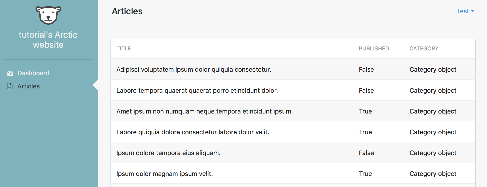
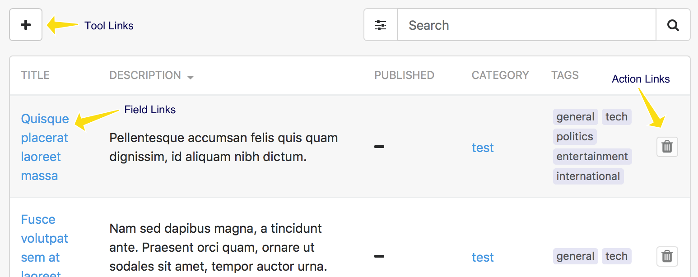

# Working with Lists

Arctic has ListViews that greatly extend the ones provided by Django, this 
tutorial will explore all its features.
It is recomended to use the project created in the [Getting Started](index.md#getting-started) chapter as a starting point.

## Database backed ListView

In this tutorial we're going to explore Arctic's ListView features, to start
we'll first create a new Django app. In the terminal, inside your project's 
directory:

    ./manage.py startapp articles

Add `'articles'` to `INSTALLED_APPS` in `config/settings.py`

Then create a data model in `articles/models.py`:

    from django.db import models

    class Article(models.Model):
        created_at = models.DateTimeField(auto_now=True)
        title = models.CharField('Title', max_length=255, null=False)
        description = models.TextField('Description', blank=True, null=False)
        published = models.BooleanField('Published', default=False)
        category = models.ForeignKey('articles.Category', verbose_name='Category')

        class Meta:
            ordering = ['id']

    class Category(models.Model):
        name = models.CharField('Name', max_length=255, null=False, blank=False,
                                unique=True)

Back in the terminal setup the database with the newly created models:

    ./manage.py makemigrations
    ./manage.py migrate

The new models need to be populated so that the ListView can display something,
since there are no forms created yet, we'll just do it in the python shell:

    # install the lorem package to generate some dummy data
    pip install lorem
    ./manage.py shell

Inside the shell:

    import lorem
    from random import choice, randint
    from articles.models import Article, Category

    categories = ['general', 'politics', 'sport', 'nature', 'international']
    for category in categories:
        Category(name=category).save()
    
    for _ in range(30):
        category_name = categories[randint(0, len(categories) - 1)]
        category = Category.objects.get(name=category_name)
        published = choice([True, False])
        Article(title=lorem.sentence(), description=lorem.paragraph(),
                published=choice([True, False]), category=category).save()

    exit()

At this point a data model has been created and populated with some random data,
so far this has been just standard Django.

Now with some data to display let's create a `ListView` in `articles/views.py`:

    from arctic.generics import ListView

    from . import models 

    class ArticleListView(ListView):
        model = models.Article
        fields = ['title', 'category', 'published']
        permission_required = 'view_articles'

After the view is created it needs to be exposed, first create a 
`articles/urls.py` and add the following:

    from django.conf.urls import url

    from . import views

    app_name = 'articles'
    urlpatterns = [
        url(r'^$', views.ArticleListView.as_view(), name='list'),
    ]

Then in `config/urls.py` add the following line in the existing `urlpatterns`:

    urlpatterns = [
        ...
        url(r'^articles', include('articles.urls')),
    ]

Finally add an entry to `ARCTIC_MENU` in `config/settings.py`:

    ARCTIC_MENU = (
        ...
        ('Articles', 'articles:list', 'fa-file-text-o'),
    )

Go to the browser and check your newly created list.
It should look something like this:

### Displaying Foreign Keys in a List

The categories are a foreign key relation and are showing 'Category Object'
instead of the category name. There are two ways to fix this:

Add a `__str__` method to the `Category` model in `articles/models.py`:

    def __str__(self):
        return self.name

Or specify the field from `Category` you want to use in `ArticleListView`. 
This can be done by appending a double underscore and the field name to be used 
to any foreign key relation in the `fields` list of a `ListView`:

    fields = [..., 'category__name']

The caveat with the second option is that the column would be labeled 'Name' 
instead of 'Category', but it can be changed by providing a verbose name for 
the column, this is done with a `('field', 'verbose name')` tuple instead of a 
string in the `fields` list:

    fields = [..., ('category__name', 'Category')]

### Pagination, Sorting and Search

The `ArticleListView` can be further improved by adding a few extra properties:

    paginate_by = 10
    ordering_fields = ['title', 'category', 'published']
    search_fields = ['title']

### Virtual Fields

Sometimes in a list you want to customize the data displayed by a field, or
add an extra field that only exists in the list view, with Arctic this is easy
to do, just create a `get_{field}_field(self, row)` method and return a string 
with the data to be displayed. 

For example to replace the `True`/`False` output from
the `published` field with some [Font Awesome icons](http://fontawesome.io/icons/) 
- already included with Arctic:

    from django.utils.safestring import mark_safe
    ...

    class ArticleListView(ListView):
        ...
        def get_published_field(self, row):
            symbol = 'fa-check' if row.published else 'fa-minus'
            return mark_safe('<i class="fa {}"></i>'.format(symbol))

If there's a need for more extensive HTML in a field, consider using a 
template file instead of embedding markup in a string.

### Links

The ListView supports 3 types of links:

- `tool_links` - these links are displayed on top right side of the table and
  are links that are not connected to the data in the table.
- `field_links` - these are linked to a column and turn the specified field 
  into a link.
- `action_links` - similar to field links, but instead of turning a field into a 
  link, they are added at the end of a row.

#### Tool Links

First let's create a tool link, this link will go to the dashboard, so in 
`articles/views.py` add the following property to `ArticleListView`:

    tool_links = [
        ('Dashboard', 'index', 'fa-dashboard'),
    ]

The `tool_links` format is a list of `('label', 'named url', 'icon')` if more
than one is given they will be displayed in a dropdown, otherwise it will be a 
button.

#### Field Links

Next we'll create a field link to a form, so the first step is to setup a basic 
form in `articles/views.py`:

    from arctic.generics import ListView, UpdateView

    ...

    class ArticleUpdateView(UpdateView):
        model = models.Article
        fields = '__all__'
        permission_required = 'change_articles'

Then expose the form on `articles/urls.py`:

    urlpatterns = [
        ...
        url(r'^update/(?P<pk>\d+)$', views.ArticleUpdateView.as_view(),
            name='update'),
    ]

Now it's ready to be used, back in `articles/views.py` add the `action_links` 
property to `ArticleListView`:

    field_links = {
        'title': 'articles:update',
    }

The `field_links` property is a dictionary of `'field': 'named url'`. 

By default the value of the `pk` field is added to the named url, this 
usually represents the primary key for each row. If other fields need to be
coupled with the named url, then a list of `('named url', 'field1', 'field2', ...)`
can be used instead of just `'named url'`.

#### Action Links

The delete function will be an action link, so first let's create an 
`ArticleDeleteView` in `articles/views.py`:

    from django.core.urlresolvers import reverse_lazy
    from arctic.generics import DeleteView, ListView, UpdateView

    ...

    class ArticleDeleteView(DeleteView):
        model = models.Article
        success_url = reverse_lazy('articles:list')
        permission_required = 'delete_article'

Expose the `ArticleDeleteView` on `articles/urls.py`:

    urlpatterns = [
        ...
        url(r'^delete/(?P<pk>\d+)$', views.ArticleDeleteView.as_view(),
            name='delete'),
    ]

Add the `action_links` property to `ArticleListView`:

    action_links = [
        ('delete', 'articles:delete', 'fa-trash'),
    ]

The `action_links` is a list of `('action name', 'named url', 'icon')`.

Like field links it will use by default `pk` together with the named_url, 
this can be changed by replacing the `'named url'` string with a list of 
`('named url', 'field1', 'field2', ...)`.
